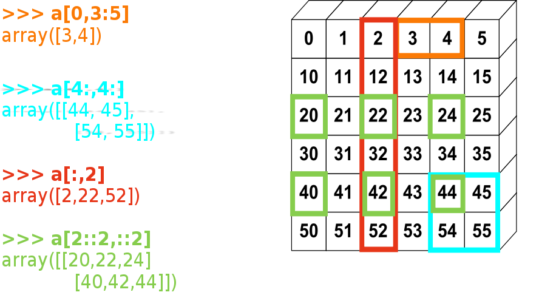
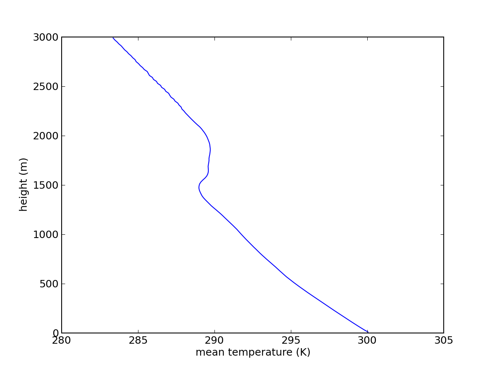

.. toctree::
   :maxdepth: 2

Creating arrays
---------------

1-D::

    >>> a = np.array([0, 1, 2, 3])
    >>> a
    array([0, 1, 2, 3])
    >>> a.ndim
    1
    >>> a.shape
    (4,)
    >>> len(a)
    4

2-D, 3-D, ...

.. code-block:: python

    >>> b = np.array([[0, 1, 2], [3, 4, 5]])    # 2 x 3 array
    >>> b
    array([[ 0,  1,  2],
           [ 3,  4,  5]])
    >>> b.ndim
    2
    >>> b.shape
    (2, 3)
    >>> len(b)     # returns the size of the first dimension
    2

    >>> c = np.array([[[1], [2]], [[3], [4]]])
    >>> c
    array([[[1],
            [2]],

           [[3],
            [4]]])
    >>> c.shape
    (2, 2, 1)

Helper functions

    * Evenly spaced::

        >>> import numpy as np
        >>> a = np.arange(10) # 0 .. n-1  (!)
        >>> a
        array([0, 1, 2, 3, 4, 5, 6, 7, 8, 9])
        >>> b = np.arange(1, 9, 2) # start, end (exlusive), step
        >>> b
        array([1, 3, 5, 7])

    * or by number of points::

        >>> c = np.linspace(0, 1, 6)   # start, end, num-points
        >>> c
        array([ 0. ,  0.2,  0.4,  0.6,  0.8,  1. ])
        >>> d = np.linspace(0, 1, 5, endpoint=False)
        >>> d
        array([ 0. ,  0.2,  0.4,  0.6,  0.8])

    * log space::

         >>> c=np.logspace(0,1,6)
         >>> c

         array([  1.        ,   1.58489319,   2.51188643,   3.98107171,
         6.30957344,  10.        ])

Basic data types
----------------

.. code-block:: python

   >>> a = np.array([1, 2, 3])
   >>> a.dtype
   dtype('int64')

   >>> b = np.array([1., 2., 3.])
   >>> b.dtype
   dtype('float64')

Assigning a datatyp::

   >>> c = np.array([1, 2, 3], dtype=float)
   >>> c.dtype
   dtype('float64')

The **default** data type is floating point::

  >>> a = np.ones((3, 3))
  >>> a.dtype
  dtype('float64')
  >>> b = np.linspace(0, 1, 6)
  >>> b.dtype
  dtype('float64')

There are also other types::

  >>> d = np.array([1+2j, 3+4j, 5+6*1j])
  >>> d.dtype
  dtype('complex128')

  >>> e = np.array([True, False, False, True])
  >>> e.dtype
  dtype('bool')

  >>> f = np.array(['Bonjour', 'Hello', 'Hallo', 'Terve', 'Hej'])
  >>> f.dtype  # <--- strings containing max. 7 letters
  dtype('|S7')         

Creating empty/filled arrays with specific dtype::

  >>> c.dtype
  dtype('float64')
  >>> c.shape
  (6,)
  >>> d=np.empty_like(c)
  >>> d.dtype
  dtype('float64')
  >>> d.shape
  (6,)
  >>> d

  array([  6.92173496e-310,   3.35579268e-316,   0.00000000e+000,
  0.00000000e+000,   0.00000000e+000,   0.00000000e+000])

  >>> c=np.ones([2,3],dtype=float16)
  >>> c

  array([[ 1.,  1.,  1.],
  [ 1.,  1.,  1.]], dtype=float16)

  >>> c=np.zeros([2,3],dtype=float32)
  >>> c

  array([[ 0.,  0.,  0.],
         [ 0.,  0.,  0.]], dtype=float32)

Indexing and slicing
--------------------

.. XXX: rewrite

The items of an array can be accessed and assigned to the same way as
other Python sequences (``list``, ``tuple``) ::

    >>> a = np.arange(10)
    >>> a
    array([0, 1, 2, 3, 4, 5, 6, 7, 8, 9])
    >>> a[0], a[2], a[-1]
    (0, 2, 9)

.. warning::

   Indices begin at 0, like other Python sequences (and C/C++).
   In contrast, in Fortran or Matlab, indices begin at 1.

For multidimensional arrays, indexes are tuples of integers::

    >>> a = np.diag(np.arange(5))
    >>> a
    array([[0, 0, 0, 0, 0],
           [0, 1, 0, 0, 0],
           [0, 0, 2, 0, 0],
           [0, 0, 0, 3, 0],
           [0, 0, 0, 0, 4]])
    >>> a[1,1]
    1
    >>> a[2,1] = 10 # third line, second column
    >>> a
    array([[ 0,  0,  0,  0,  0],
           [ 0,  1,  0,  0,  0],
           [ 0, 10,  2,  0,  0],
           [ 0,  0,  0,  3,  0],
           [ 0,  0,  0,  0,  4]])
    >>> a[1]
    array([0, 1, 0, 0, 0])

Note that:

* In 2D, the first dimension corresponds to rows, the second to columns.
* for multidimensional ``a``,`a[0]` is interpreted by
  taking all elements in the unspecified dimensions.

.. rubric:: Slicing

Arrays, like other Python sequences can also be sliced::

    >>> a = np.arange(10)
    >>> a
    array([0, 1, 2, 3, 4, 5, 6, 7, 8, 9])
    >>> a[2:9:3] # [start:end:step]
    array([2, 5, 8])

Note that the last index is not included!::

    >>> a[:4]
    array([0, 1, 2, 3])

``start:end:step`` is a ``slice`` object which represents the set of indexes
``range(start, end, step)``. A ``slice`` can be explicitly created::

    >>> sl = slice(1, 9, 2)
    >>> a = np.arange(10)
    >>> b = np.arange(1, 20, 2)
    >>> a, b
    (array([0, 1, 2, 3, 4, 5, 6, 7, 8, 9]), array([ 1,  3,  5,  7,  9, 11, 13, 15, 17, 19]))
    >>> a[sl], b[sl]
    (array([1, 3, 5, 7]), array([ 3,  7, 11, 15]))

All three slice components are not required: by default, `start` is 0, `end` is the
last and `step` is 1::

    >>> a[1:3]
    array([1, 2])
    >>> a[::2]
    array([0, 2, 4, 6, 8])
    >>> a[3:]
    array([3, 4, 5, 6, 7, 8, 9])

Of course, it works with multidimensional arrays::

    >>> a = np.eye(5)
    >>> a
    array([[ 1.,  0.,  0.,  0.,  0.],
           [ 0.,  1.,  0.,  0.,  0.],
           [ 0.,  0.,  1.,  0.,  0.],
           [ 0.,  0.,  0.,  1.,  0.],
           [ 0.,  0.,  0.,  0.,  1.]])
    >>> a[2:4,:3] # 3rd and 4th rows, 3 first columns
    array([[ 0.,  0.,  1.],
           [ 0.,  0.,  0.]])

All elements specified by a slice can be easily modified::

    >>> a[:3,:3] = 4
    >>> a
    array([[ 4.,  4.,  4.,  0.,  0.],
           [ 4.,  4.,  4.,  0.,  0.],
           [ 4.,  4.,  4.,  0.,  0.],
           [ 0.,  0.,  0.,  1.,  0.],
           [ 0.,  0.,  0.,  0.,  1.]])

A small illustrated summary of Numpy indexing and slicing...

Copies and views
----------------

A slicing operation creates a **view** on the original array, which is
just a way of accessing array data. Thus the original array is not
copied in memory.

**When modifying the view, the original array is modified as well**::

    >>> a = np.arange(10)
    >>> a
    array([0, 1, 2, 3, 4, 5, 6, 7, 8, 9])
    >>> b = a[::2]; b
    array([0, 2, 4, 6, 8])
    >>> b[0] = 12
    >>> b
    array([12,  2,  4,  6,  8])
    >>> a   # (!)
    array([12,  1,  2,  3,  4,  5,  6,  7,  8,  9])

    >>> a = np.arange(10)
    >>> b = a[::2].copy()  # force a copy
    >>> b[0] = 12
    >>> a
    array([0, 1, 2, 3, 4, 5, 6, 7, 8, 9])

This behavior can be surprising at first sight... but it allows to save both
memory and time.

Example dataset
_______________

Read in a dataset with three variables::

  >>> import matplotlib
  >>> import numpy as np
  >>> import matplotlib.pyplot as plt
  >>> array_data=np.load('array_data.npz')
  >>> temps=array_data['temp']
  >>> press=array_data['press']
  >>> height=array_data['height']

Note the shapes::

  >>> temps.shape
  (150, 30, 30)
  >>> press.shape
  (150,)
  >>> height.shape
  (150,)

Plot the vertically averaged temperature using this script:

.. literalinclude:: plot_profile.py

Extract  temperatures for heights above 2 km::

  >>> hit = height > 2000.
  >>> np.sum(hit)
  50
  >>> high_temps=temps[hit,:,:]
  >>> high_temps.shape
  (50, 30, 30)

Getting started
---------------
Examples from http://scipy-lectures.github.com

>>> import numpy as np
>>> a = np.array([0, 1, 2, 3])
>>> a
array([0, 1, 2, 3])

Reference documentation
-----------------------

- On the web: http://docs.scipy.org/

- Interactive help:

  .. code-block:: python

     >>> help(np.array)
     array(object, dtype=None, copy=True, order=None, subok=False, ndmin=0)

     Create an array.

     Parameters
     ----------
     object : array_like
     ...

     Examples
     --------
     >>> np.array([1, 2, 3])
     array([1, 2, 3])
     ...

- Looking for something:

  >>> np.lookfor('create array')
  Search results for 'create array'
  ---------------------------------
  numpy.array
      Create an array.
  numpy.memmap
      Create a memory-map to an array stored in a *binary* file on disk.
  ...

  >>> help(np.lookfor)
  Help on function lookfor in module numpy.lib.utils:
  ...

.. the import convention, reminder on python imports
.. where to find the documentation
.. using help(np.argsort), using lookfor('sort array')

